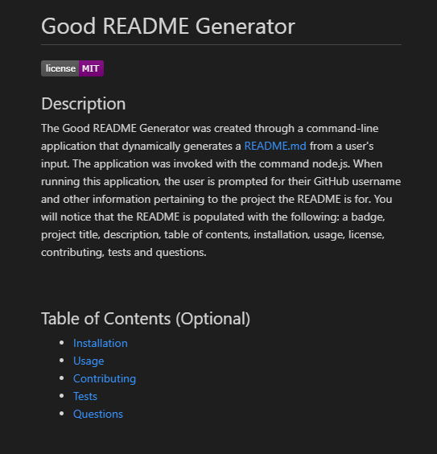
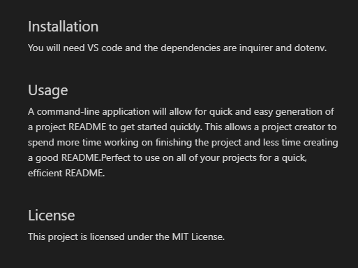
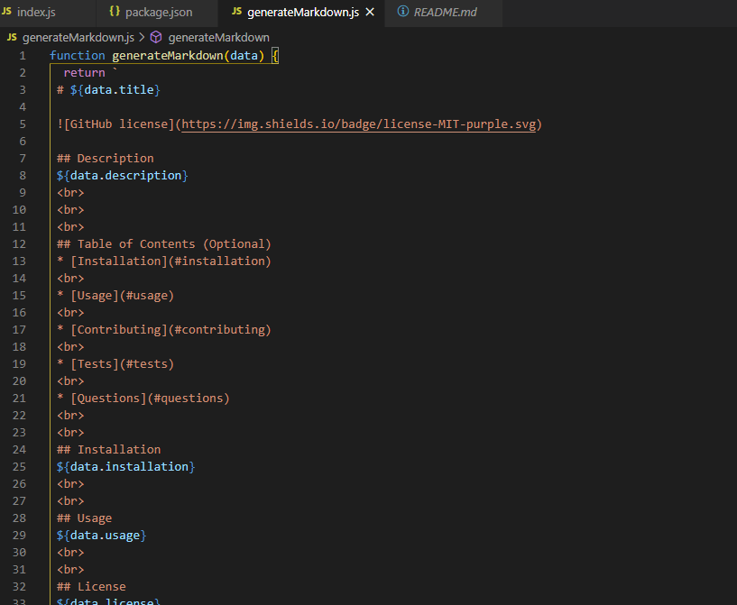
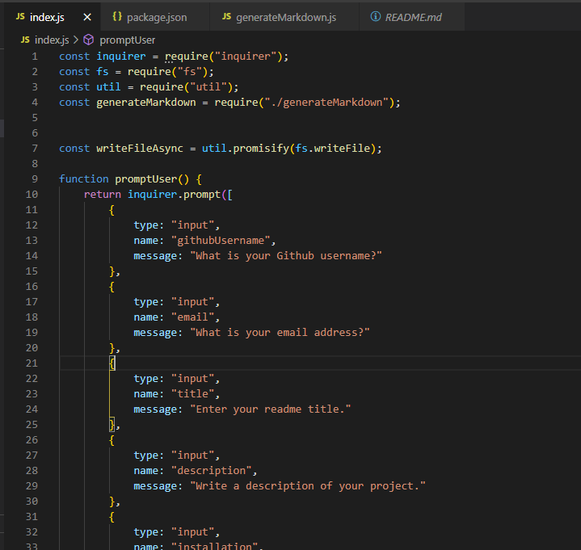

 # Good README Generator
 ## Description 
 The Good README Generator was created through a command-line application that dynamically generates a README.md from a user's input. The application was invoked with the command node.js. When running this application, the user is prompted for their GitHub username and other information pertaining to the project the README is for. You will notice that the README is populated with the following: a badge, project title, description, table of contents, installation, usage, license, contributing, tests and questions.
 
## Process
 It was very interesting to find out that we could open the terminal inside our VS Code app. This was a great preview of how the backend side works by completing this project. First I had to make sure that all of the dependencies were installed and then I had to create prompts and a function inside the index.js file. After hooking everything from the index.js to the generateMarkdown.js file, I was able to test and run node index.js inside the terminal to see how the README Generator would produce my README file. It was rewarding to see that I had created a good README! I'm pleased on how it looks. Please see below for some snippets:

 My Good README File that got generated through GitBash:

 
 
 
 

 Snippet of the generateMarkdown.js code:
 
 Snippet of the index.js code:
 

 ## Installation
 You will need VS code and the dependencies are inquirer and dotenv.
 
 ## Usage 
 A command-line application will allow for quick and easy generation of a project README to get started quickly. This allows a project creator to spend more time working on finishing the project and less time creating a good README.Perfect to use on all of your projects for a quick, efficient README.

 ## Tests
 Open VS code, right click and open in integrated terminal. Type node index.js and run the file. Answer all the prompts and it will quickly plug in all of your data into the correct sections of the README template. 
 

### Installing/Technology Used

The following platforms were required to build this website:

1) VS code
2) GitBash/Terminal
3) GitLab
4) GitHub

## Built With

* [Node.js](https://nodejs.dev/learn/the-package-json-guide)

 ## Authors

* **Kelly Kim** 

- [Link to Github](https://github.com/kellykim831)
- [Link to LinkedIn](https://www.linkedin.com/in/realtorkellykim/)
- [Link to Facebook](https://www.facebook.com/kimkelz)

## Acknowledgments

* [Link to Google](https://www.google.com)
* [Link to W3 Schools](https://www.w3schools.com)
* [Link to Node.js](https://nodejs.org/en/)

